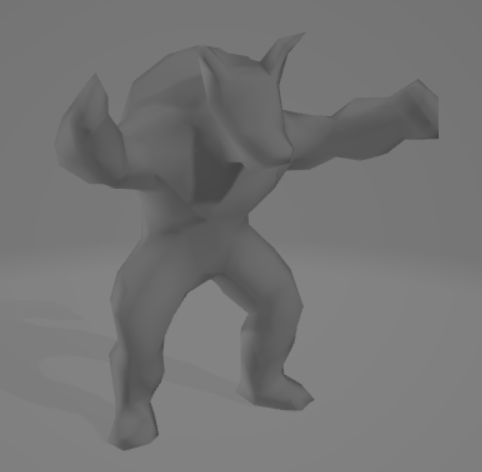
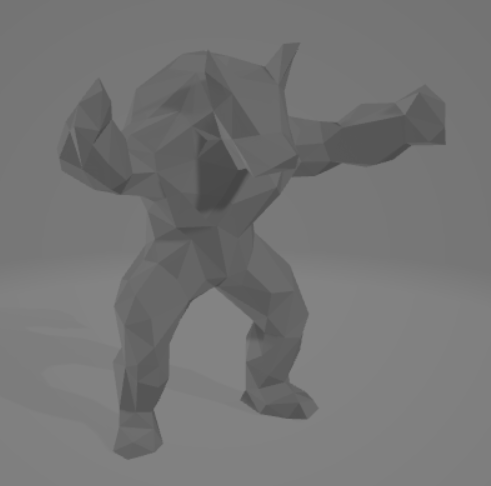
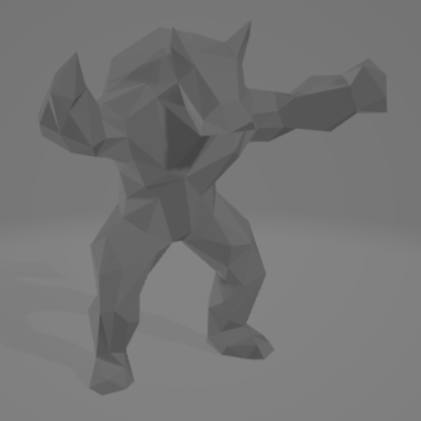
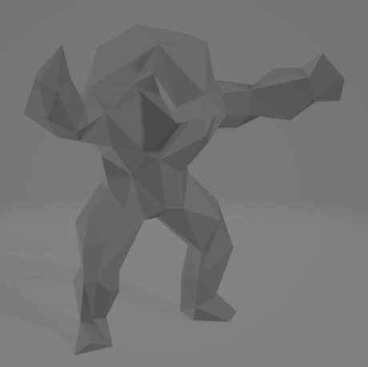
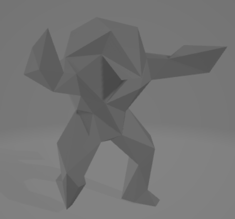

# mesh-simplification
Implements a mesh simplification algorithm based on the paper: Garland, Michael, and Paul S. Heckbert. "Surface simplification using quadric error metrics." Proceedings of the 24th annual conference on Computer graphics and interactive techniques. 1997.

## Example Outputs

*Original mesh with 718 triangle faces.*

 

*Simplified to have 80% of the number of faces.*

 

*Simplified to have 60% of the number of faces.*

 

*Simplified to have 40% of the number of faces.*

 

*Simplified to have 20% of the number of faces.*

 

*Simplified to have 10% of the number of faces.*